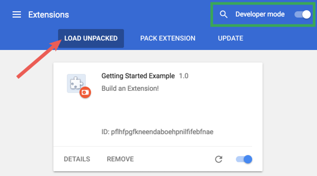

# blues-chrome-extension

## Purpose

Detect Your Hate Speech Unconsciously used

## Install Blues Chrome Extension

1. clone git

    ```sh
    git clone git@github.com:highballuos/blues-chrome-extension.git
    ```

2. go to extension setting page and install

    - Open the Extension Management page by navigating to chrome://extensions.
    Alternatively, open this page by clicking on the Extensions menu button and selecting Manage Extensions at the bottom of the menu.
    Alternatively, open this page by clicking on the Chrome menu, hovering over More Tools then selecting Extensions

    - Enable Developer Mode by clicking the toggle switch next to Developer mode.

    - Click the Load unpacked button and select the extension directory. (ex. /your blues directory/blues)

        

    - That's all

## On/Off

1. At top right, Click Chrome Extension icon and pin Blues

    

2. At top right, Click Blues icon and turn on and off!!

    
